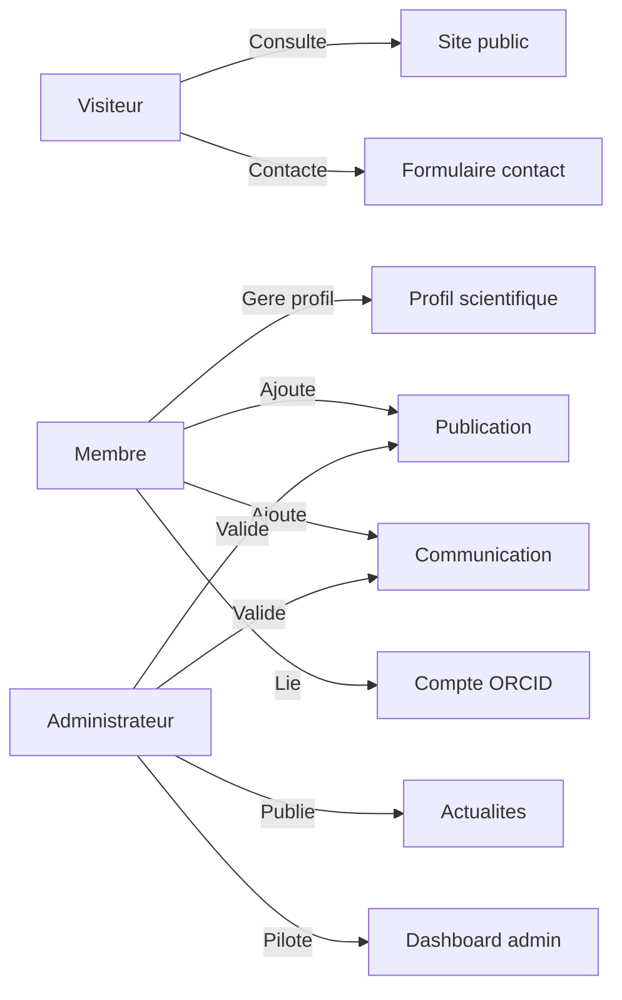
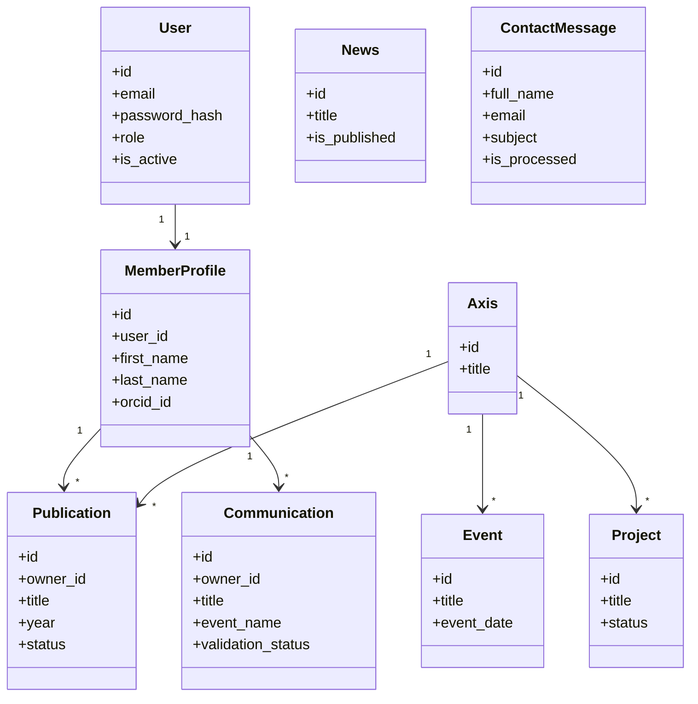

# Diagrammes UML (Mermaid)

## Cas d'utilisation principal

```mermaid
flowchart LR
  V[Visiteur] -->|Consulte| Site[Site public]
  V -->|Contacte| Contact[Formulaire contact]
  M[Membre] -->|Gere profil| Profil[Profil scientifique]
  M -->|Ajoute| Pub[Publication]
  M -->|Ajoute| Com[Communication]
  M -->|Lie| ORCID[Compte ORCID]
  A[Administrateur] -->|Valide| Pub
  A -->|Valide| Com
  A -->|Publie| News[Actualites]
  A -->|Pilote| Dash[Dashboard admin]
```

## Diagramme de classes simplifie

```mermaid
classDiagram
  class User {
    +id
    +email
    +password_hash
    +role
    +is_active
  }

  class MemberProfile {
    +id
    +user_id
    +first_name
    +last_name
    +orcid_id
  }

  class Publication {
    +id
    +owner_id
    +title
    +year
    +status
  }

  class Communication {
    +id
    +owner_id
    +title
    +event_name
    +validation_status
  }

  class Project {
    +id
    +title
    +status
  }

  class Axis {
    +id
    +title
  }

  class Event {
    +id
    +title
    +event_date
  }

  class News {
    +id
    +title
    +is_published
  }

  class ContactMessage {
    +id
    +full_name
    +email
    +subject
    +is_processed
  }

  User "1" --> "1" MemberProfile
  MemberProfile "1" --> "*" Publication
  MemberProfile "1" --> "*" Communication
  Axis "1" --> "*" Publication
  Axis "1" --> "*" Event
  Axis "1" --> "*" Project
```
